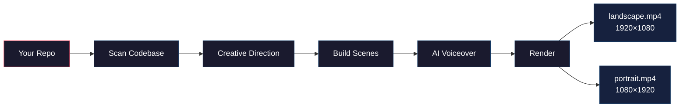

<div align="center">

<br/>

# promo-video-skill

**Turn any codebase into a professional promo video.**

One command. Landscape + Portrait. AI Voiceover. Ready to post.

<br/>

[](LICENSE)
&nbsp;&nbsp;
[](https://claude.ai/code)
&nbsp;&nbsp;
[](https://remotion.dev)
&nbsp;&nbsp;
[](https://elevenlabs.io)

<br/>

Point Claude Code at your repo — it scans your codebase, finds your logo,<br/>brand colors, and features, then builds an entire animated video<br/>with AI voiceover and renders it in both formats.

<br/>

</div>

---

<br/>

## Install

```bash
npx skills add remotion-dev/skills         # Remotion fundamentals (required)
npx skills add AKCodez/promo-video-skill   # Promo video workflow
```

```bash
export ELEVENLABS_API_KEY="sk_your_key_here"   # Free at elevenlabs.io
```

> [!TIP]
> Then just open Claude Code in your project and say: **"Create a promo video for this project"**

<br/>

---

<br/>

## How It Works



<br/>

<table>
<tr><td width="50%" valign="top">

### Phase 0 &nbsp;·&nbsp; Preflight

Validates your environment automatically. Node.js, API key, ffmpeg, Whisper — tells you exactly how to fix anything missing.

</td><td width="50%" valign="top">

### Phase 1 &nbsp;·&nbsp; Brand Discovery

Scans your repo and extracts:

| | |
|:--|:--|
| **Name** | from `package.json`, README |
| **Logo** | `icon.png`, `logo.svg`, favicon |
| **Colors** | CSS variables, Tailwind config |
| **Stack** | React, Next.js, Tailwind, etc. |

</td></tr>
<tr><td valign="top">

### Phase 2 &nbsp;·&nbsp; Creative Direction

You pick:

| | |
|:--|:--|
| **Duration** | 30s · 60s · 90s |
| **Theme** | Dark mode · Light mode |
| **Voice** | 5 built-in + browse ElevenLabs |
| **Story** | Rage Hook · Problem Stack · Demo First · Transformation |
| **Transitions** | Metallic swoosh · Zoom · Fade · Slide |

</td><td valign="top">

### Phase 3 &nbsp;·&nbsp; Build

Creates a full Remotion project:

- Spring animations + 3D browser mockups
- Shared scene components for both formats
- 2-4 second scenes for max engagement
- Preview in Remotion Studio before continuing

</td></tr>
<tr><td valign="top">

### Phase 4 &nbsp;·&nbsp; Voiceover

AI narration with **emotional presets per scene**. Timing verified with Whisper. Overlaps auto-fixed.

</td><td valign="top">

### Phase 5 &nbsp;·&nbsp; Render

Both formats rendered, music mixed, audio combined — two MP4s ready to upload.

</td></tr>
</table>

<br/>

---

<br/>

## Voiceover Emotional Presets

> The AI voice changes emotion per scene — not one flat tone for the whole video.

<br/>

| Preset | Feel | Example |
|:-------|:-----|:--------|
| **Rage** | Unstable, intense, raw | *"Are you serious right now?!"* |
| **Whisper** | Intimate, conspiratorial | *"What if you never had to guess again?"* |
| **Confident** | Balanced, authoritative | *"Smart detection scans instantly."* |
| **Warm** | Smooth, trustworthy | *"Join 50,000 users."* |
| **Dramatic** | Cinematic, high-stakes | *"Try it now. Free."* |

<br/>

> [!IMPORTANT]
> Voiceover is verified with **Whisper** after generation. If any narration bleeds into the next scene, Claude automatically shortens the text, regenerates, and re-verifies. Zero manual timing work.

<br/>

---

<br/>

## Narrative Templates

<table>
<tr>
<td width="25%" align="center">

**The Rage Hook**

Frustration<br/>↓<br/>Silence<br/>↓<br/>Whisper<br/>↓<br/>Reveal<br/>↓<br/>Features<br/>↓<br/>CTA

</td>
<td width="25%" align="center">

**The Problem Stack**

Pain<br/>↓<br/>Pain<br/>↓<br/>Pain<br/>↓<br/>*"What if..."*<br/>↓<br/>Solution<br/>↓<br/>CTA

</td>
<td width="25%" align="center">

**The Demo First**

Magic Moment<br/>↓<br/>*"How?"*<br/>↓<br/>Explanation<br/>↓<br/>Features<br/>↓<br/>Proof<br/>↓<br/>CTA

</td>
<td width="25%" align="center">

**The Transformation**

Before *(pain)*<br/>↓<br/>After *(joy)*<br/>↓<br/>How<br/>↓<br/>Features<br/>↓<br/>Proof<br/>↓<br/>CTA

</td>
</tr>
<tr>
<td align="center"><sub>Best for painful problems.<br/>Highest engagement.</sub></td>
<td align="center"><sub>Best for multiple pain points.<br/>Builds urgency.</sub></td>
<td align="center"><sub>Best when the UX sells itself.<br/>Hook first, explain later.</sub></td>
<td align="center"><sub>Best for workflow improvements.<br/>Before/after contrast.</sub></td>
</tr>
</table>

<br/>

---

<br/>

## Voices

### Built-in (Free Tier)

| Voice | Style | Best For |
|:------|:------|:---------|
| **Matilda** | Warm, confident female | Default — versatile |
| **Rachel** | Calm, authoritative female | Corporate, B2B |
| **Daniel** | Polished, broadcast male | Advertising, launches |
| **Josh** | Friendly, conversational male | Consumer apps |
| **Adam** | Deep, dramatic male | Cinematic, intense hooks |

> [!TIP]
> Want something different? Say *"Browse ElevenLabs voices for a sinister dramatic male voice"* — Claude searches the library, generates test samples, and lets you audition them.

<br/>

---

<br/>

## What's Inside

```
skills/promo-video/
│
│   SKILL.md                      ← Main skill — the 5-phase workflow
│   voiceover.md                  ← ElevenLabs + Whisper timing guide
│   narrative-templates.md        ← 4 story structures with scene breakdowns
│   multi-format.md               ← Responsive 16:9 + 9:16 architecture
│   brand-discovery.md            ← Auto-detect logos, colors, fonts
│   metallic-swoosh.md            ← Custom metallic shine transition
│   promo-patterns.md             ← Visual inspiration catalog
│
├── scripts/
│   │   preflight.ts              ← Environment validation
│   │   discover-brand.ts         ← Repo scanner for brand assets
│   │   discover-voices.ts        ← ElevenLabs voice browser + sampler
│   │   timing-calculator.ts      ← TransitionSeries duration math
│   │   generate-voiceover.ts     ← Full voiceover generation pipeline
│
└── music/
        inspired-ambient.mp3      ← Ambient, atmospheric
        motivational-day.mp3      ← Commercial, uplifting
        upbeat-corporate.mp3      ← Inspiring, energetic
```

<br/>

<details>
<summary><b>Scripts Reference</b></summary>

<br/>

**preflight.ts** — Environment check
```bash
npx tsx scripts/preflight.ts
```

**discover-brand.ts** — Scan a repo for brand assets
```bash
npx tsx scripts/discover-brand.ts ~/path/to/your-repo
```

**discover-voices.ts** — Browse + sample ElevenLabs voices
```bash
npx tsx scripts/discover-voices.ts --query "confident female" --samples 3
```

**timing-calculator.ts** — Exact duration accounting for transition overlaps
```bash
npx tsx scripts/timing-calculator.ts --scenes "120,90,60,90,90" --transition 12 --fps 30 --target 60
```

**generate-voiceover.ts** — Generate, verify, and fix voiceover
```bash
npx tsx scripts/generate-voiceover.ts --config voiceover-config.json
```

</details>

<br/>

---

<br/>

## Prerequisites

| Requirement | | Install |
|:------------|:--:|:--------|
| **Node.js 18+** | Required | [nodejs.org](https://nodejs.org) |
| **Claude Code** | Required | [claude.ai/code](https://claude.ai/code) |
| **`remotion-dev/skills`** | Required | `npx skills add remotion-dev/skills` |
| **ElevenLabs API Key** | Required | Free at [elevenlabs.io](https://elevenlabs.io) |
| **ffmpeg** | Auto | Bundled via `bunx remotion ffmpeg` |
| **Whisper** | Optional | `pip install openai-whisper` |

<br/>

<details>
<summary><b>About the Remotion Skill (peer dependency)</b></summary>

<br/>

This skill depends on [`remotion-dev/skills`](https://github.com/remotion-dev/skills) — the official Remotion skill with **30+ rule files**:

| Category | Rules |
|:---------|:------|
| **Core** | Animations, timing, interpolation, sequencing, compositions |
| **Transitions** | Fade, slide, wipe, custom presentations |
| **Media** | Images, videos, audio, GIFs, fonts |
| **Advanced** | Three.js 3D, charts, text animations, captions |
| **Audio** | Sound effects, visualization, voiceover |
| **Tools** | FFmpeg, DOM measurement, Tailwind, light leaks |

The Remotion skill teaches Claude *how to write Remotion code*.<br/>
This skill teaches Claude *how to produce a complete promo video*.

</details>

<br/>

> [!NOTE]
> **You don't need to install ffmpeg.** This skill uses `bunx remotion ffmpeg` — bundled, cross-platform, zero PATH issues. Works on Windows, macOS, and Linux out of the box.

<br/>

---

<br/>

## Tips

| | |
|:--|:--|
| **Be specific** | "College students struggling with online quizzes" beats "students" |
| **3-5 features max** | More dilutes the message |
| **Use the Rage Hook** | Highest engagement for consumer products |
| **2-4 second scenes** | Shorter scenes hold attention better |
| **Preview first** | Run `npx remotion studio` before adding voiceover |

<br/>

## Troubleshooting

| Problem | Fix |
|:--------|:----|
| Voiceover overlaps | Claude auto-fixes — or ask to regenerate |
| Elements too small | *"Scale up the elements"* or *"make text bigger"* |
| Video feels slow | *"Shorter scenes"* or *"quicker transitions"* |
| Portrait looks cramped | Claude adapts via LayoutContext — request adjustments |
| ElevenLabs 401 | Check API key in environment |
| Premium voice error | Use one of the 5 built-in voices (free tier) |

<br/>

---

<div align="center">

<br/>

**MIT License**

Built from real production experience.<br/>Every pain point was hit during actual video production and fixed in this skill.

<br/>

[Install](#install) &nbsp;·&nbsp; [How It Works](#how-it-works) &nbsp;·&nbsp; [Remotion](https://remotion.dev) &nbsp;·&nbsp; [ElevenLabs](https://elevenlabs.io) &nbsp;·&nbsp; [Claude Code](https://claude.ai/code)

<br/>

</div>
